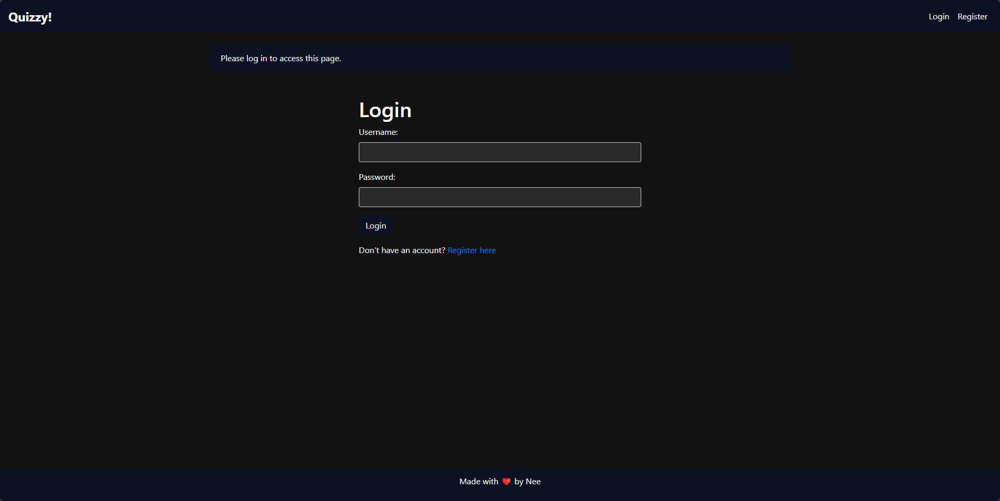
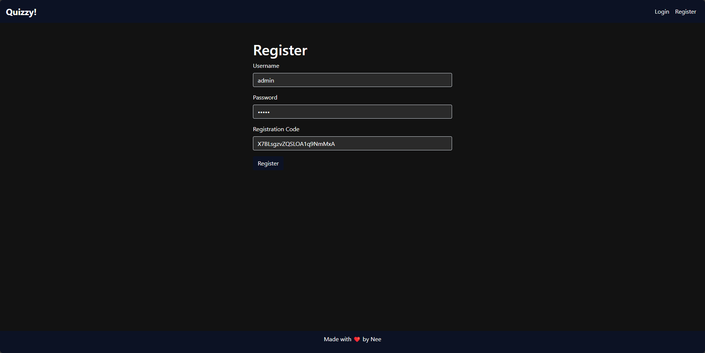
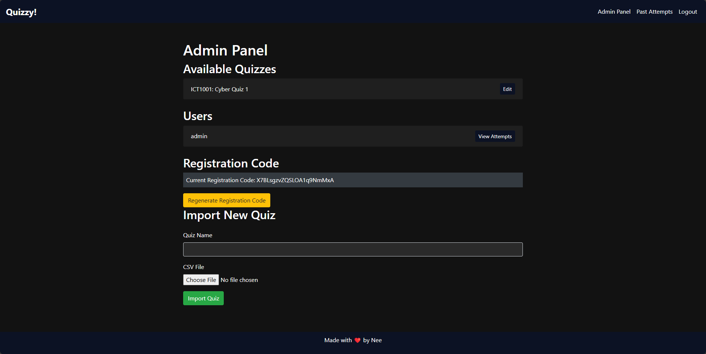
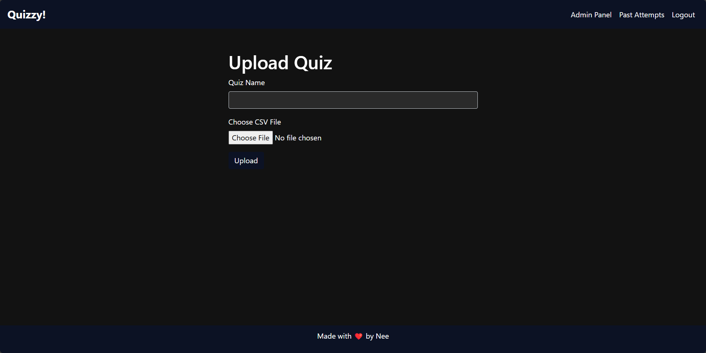
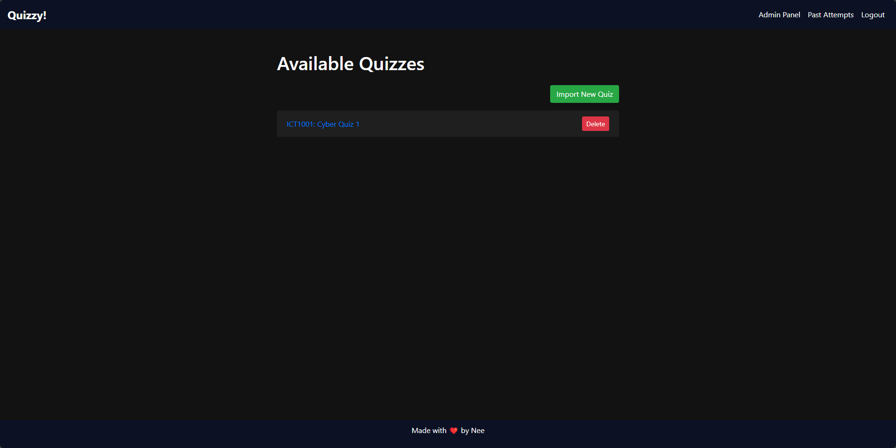
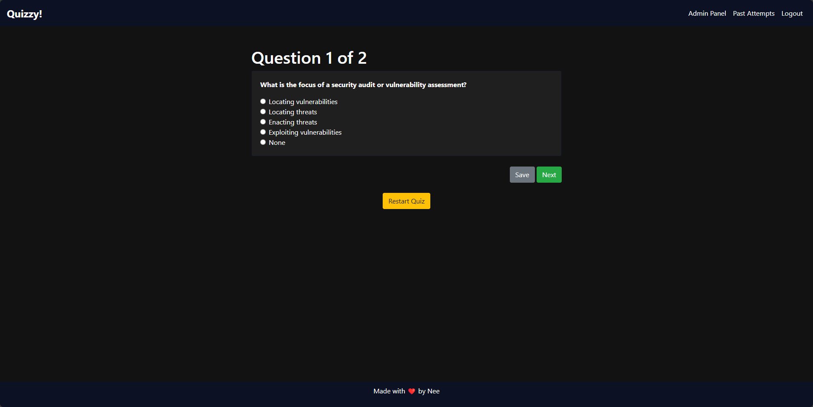
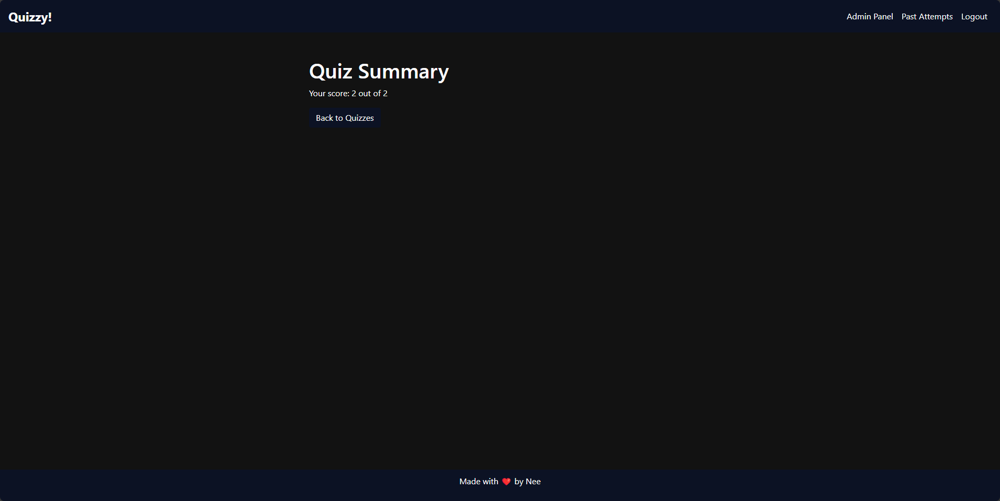
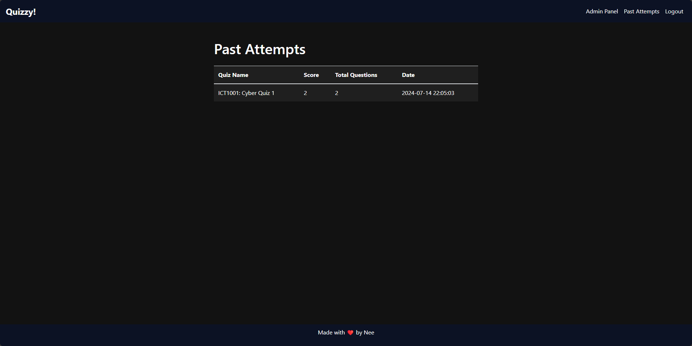

# Quizzy!


Quizzy! is a Flask-based quiz platform designed to help educators create, manage, and administer quizzes to their students. The platform includes features such as user authentication, quiz management, question randomization, progress tracking, and more.

## Features

- **User Authentication**: Secure login and registration with admin and student roles.
- **Admin Panel**: Admins can create, edit, and delete quizzes. They can also manage users and view user attempts.
- **Quiz Management**: Create quizzes by uploading CSV files, edit quiz questions, and delete quizzes.
- **Question Randomization**: Each quiz presents questions in a random order.
- **Progress Tracking**: Users can save their progress and resume quizzes later.
- **Responsive Design**: Mobile-friendly layout.

[__Jump to Screenshots!__](#screenshots)

## Getting Started

### Quick Start (Instant Deployment:Docker)

```
docker run -p 80:80 neeranjan/quizzy-app
```

### Prerequisites

- Python 3.8+
- Docker (optional, for containerized deployment)

### Configuration
Registration Code: A registration code is required for new/any users to register. This code can be regenerated by the admin and is stored in registration_code.txt. This code will also be printed out on the terminal upon initial run.
__note: you have to manually create an account named `admin` with this initial token to activate the administrator account__

### Installation

1. Clone the repository:

   ```
   sh
   git clone https://github.com/ItsNee/quizzy
   cd quizzy
   ```

2. Create and activate a virtual environment:

    ```
    sh
    Copy code
    python -m venv venv
    source venv/bin/activate  # On Windows use `venv\Scripts\activate`
    ```

3. Install the dependencies:

    ```
    sh
    Copy code
    pip install -r requirements.txt
    ```

4. Run the application:

    ```
    python app.py
    ```

5. Access the application at:

    ```
    http://127.0.0.1
    ```

## Screenshots

### Login and Register Pages
<div style="display: flex; justify-content: space-between;">
    
    
</div>

### Admin Panel and Import Quiz
<div style="display: flex; justify-content: space-between;">
    
    
</div>

### Quizzes List and Quiz Question
<div style="display: flex; justify-content: space-between;">
    
    
</div>

### Quiz Summary and Quiz Attempts
<div style="display: flex; justify-content: space-between;">
    
    
</div>

### File Structure
```
/quizzy
│
├── app.py
├── models.py
├── requirements.txt
├── Dockerfile
├── /templates
│   ├── base.html
│   ├── index.html
│   ├── login.html
│   ├── register.html
│   ├── quizzes.html
│   ├── admin.html
│   ├── quiz_question.html
│   ├── quiz_summary.html
│   └── past_attempts.html
├── /static
│   ├── favicon.ico
│   └── style.css
└── /images
    ├── login.png
    ├── register.png
    ├── adminPanel.png
    ├── importQuiz.png
    ├── quizzes.png
    ├── quizQuestion.png
    ├── quizSummary.png
    └── quizAttempts.png
```

### Usage
- Register a New User: Navigate to the registration page and enter the required information along with the registration code provided by the admin.
- Login: Use your credentials to log in.
- Admin Panel: Admin users can access the admin panel to manage quizzes and users.
- Take a Quiz: Start a quiz, answer questions, save progress, and resume later if needed.
- View Past Attempts: Users can view their past quiz attempts and scores.

---

### License
This project is licensed under the MIT License

Acknowledgements
Flask
SQLAlchemy
Bootstrap
Docker

### Acknowledgements
- Flask
- SQLAlchemy
- Bootstrap
- Docker